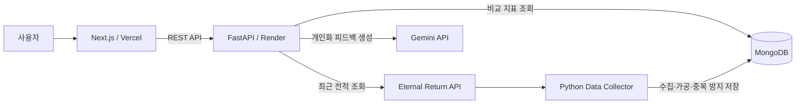

# 아디나의 수정구슬

> 이터널 리턴 최근 전적을 분석하고 Gemini API로 개인화 피드백을 제공한 웹 서비스

누적 활성 사용자 **2.6만 명** 규모의 서비스를 2인 팀으로 개발·운영했습니다. 본 저장소는 운영 종료 후 테스트 및 포트폴리오 검토가 가능하도록 정리한 버전입니다.

## 핵심 성과

- GA4 기준 활성 사용자 **2.6만 명**, 이벤트 **48만 회**, 활성 사용자당 평균 참여 시간 **2분 36초**
- FastAPI 기반 REST API와 Gemini API 기반 개인화 피드백 기능 개발
- 외부 게임 API 변경에 맞춰 `gameId` 기반 데이터 수집기로 재설계
- 백엔드를 계층형 구조로 리팩터링하고 운영·테스트 환경 분리
- 2인 팀에서 기획, 백엔드, AI 기능, 운영, QA, CS 담당

| 구분 | 내용 |
| --- | --- |
| 개발 기간 | 2025.05 ~ 2026.05.17 |
| 운영 기간 | 2025.08.29 ~ 2026.05.17 |
| 팀 구성 | 2인 |
| 본인 담당 | 기획 · 백엔드 · AI 기능 · 데이터 수집 · 운영 · QA · CS |
| 현재 상태 | 서비스 종료 · 테스트 및 포트폴리오용 저장소 운영 |

## 담당 역할

- FastAPI 기반 REST API와 MongoDB 연동 설계 및 구현
- Eternal Return API 연동과 최근 전적 수집·가공 로직 구현
- 전적·비교 지표를 활용하는 Gemini 프롬프트 및 개인화 피드백 기능 구현
- 데이터 수집기 재설계, 백엔드 계층 분리, 요청 실패 대응 로직 구현
- 서비스 기획, 배포 환경 관리, QA, 운영 모니터링, 사용자 문의 대응

## 기술 스택

**Frontend**

**Backend & Data**

**AI & External API**

**Deploy**

## 시스템 아키텍처

사용자 요청은 FastAPI 백엔드가 조율합니다. 최근 전적은 Eternal Return API에서 조회하고, MongoDB의 비교 지표와 결합한 뒤 Gemini API를 병렬 호출해 최종 분석 응답을 구성합니다. 별도 데이터 수집기는 게임 데이터를 주기적으로 수집·가공해 비교 지표의 기반 데이터를 갱신합니다.

## 프로젝트 배경

기존 전적 검색 서비스는 시즌 전체 통합 전적을 중심으로 지표를 제공했습니다. 시즌 초반 하위 티어 기록까지 함께 집계되면 사용자의 현재 플레이 수준과 지표 사이에 차이가 생길 수 있었습니다.

아디나의 수정구슬은 **최근 전적에 범위를 한정한 지표**와 **비교 통계 기반의 AI 피드백**을 제공해 사용자가 현재 플레이를 빠르게 점검할 수 있도록 기획했습니다.

## 주요 기능

- **전적 검색**: 닉네임으로 사용자를 찾아 최근 랭크·일반·코발트 전적 조회
- **지표 시각화**: KDA, 승률, 픽률 등 주요 지표와 비교 통계를 차트로 제공
- **AI 개인화 피드백**: 전적 지표와 캐릭터·티어 비교 데이터를 프롬프트에 결합해 피드백 생성
- **뱃지 시스템**: 전적 조건에 따라 업적과 뱃지 부여

## 서비스 화면

| 메인 | 로딩 | 분석 결과 |
| --- | --- | --- |
|  |  |  |
| 닉네임 검색 페이지 | 데이터 로딩 화면 | 전적 분석 결과 페이지 |

| 상세 지표 | 사이드바 | 뱃지 도감 | 패치노트 |
| --- | --- | --- | --- |
|  |  |  |  |
| 상세 지표 비교 | 추가 메뉴 | 뱃지 획득 조건 | 업데이트 내역 |

## 운영 성과

> GA4 집계 기간: **2025.05.01 ~ 2026.05.17**

| 지표 | 결과 |
| --- | ---: |
| 활성 사용자 | **2.6만 명** |
| 새 사용자 | **2.6만 명** |
| 활성 사용자당 평균 참여 시간 | **2분 36초** |
| 이벤트 수 | **48만 회** |

## 트러블슈팅

### 1. 계층형 아키텍처 도입

- **문제**: `main.py`에 기능이 집중되면서 파일이 비대해지고, 팀 작업 중 병합 충돌과 롤백이 반복됐습니다.
- **해결**: 백엔드를 `routers`, `services`, `core`, `db`, `common`, `exceptions`로 나누고 `main.py`는 애플리케이션 설정과 모듈 연결을 담당하도록 재구성했습니다.
- **결과**: API 라우팅, 비즈니스 로직, 설정, DB 연결, 예외 처리를 독립적으로 수정할 수 있는 구조를 확보했습니다.

### 2. 외부 API 변경에 따른 데이터 수집기 재설계

- **문제**: 외부 게임 API의 사용자 식별 방식이 변경되면서 사용자 목록을 따라가던 기존 수집 방식이 동작하지 않았습니다.
- **해결**: 연속적으로 증가하는 `gameId` 특성을 활용해 최신 ID부터 역순으로 탐색하도록 수집기를 재설계했습니다. 요청량은 limiter로 제어하고, 게임 날짜를 종료 조건으로 사용했으며, `gameId` 기준 upsert로 중복 저장을 방지했습니다.
- **결과**: 특정 사용자 목록에 의존하지 않고 최근 게임 단위로 데이터를 다시 수집할 수 있게 됐습니다.

### 3. 제한된 예산에서의 운영 환경 구성

- **문제**: 별도 수익원 없이 서버와 데이터베이스, AI API를 지속적으로 운영해야 했습니다.
- **해결**: Vercel, Render, MongoDB의 초기 무료 인프라와 Google 프로모션 크레딧을 활용해 운영 환경을 구성했습니다.
- **결과**: 서비스 초기 운영 비용을 최소화하면서 실제 사용자 트래픽을 검증했습니다.

### 4. 운영·테스트 환경 분리

- **문제**: 라이브 환경에서 직접 배포와 테스트를 진행해 사용자에게 버그가 노출되거나 서비스가 중단되는 문제가 있었습니다.
- **해결**: 운영 환경과 테스트 환경을 분리하고, 테스트 환경에서 QA를 통과한 코드만 운영 환경에 배포하는 절차를 만들었습니다.
- **결과**: 변경 사항을 운영 배포 전에 검증할 수 있게 됐고, 라이브 환경에서의 직접 테스트를 줄였습니다.

### 5. AI API 요청 실패 대응

- **문제**: 사용자 증가와 API 마이그레이션 과정에서 요청 한도 초과, 일시적 서버 오류, 네트워크 타임아웃이 발생했습니다.
- **해결**: AI API 호출을 별도 서비스 모듈로 분리하고, 세마포어로 동시 요청 수를 제한했습니다. 오류 유형을 기록하고 요청 실패 시 재시도하며, 일부 AI 작업이 실패해도 전체 전적 응답이 중단되지 않도록 예외를 격리했습니다.
- **결과**: AI 응답 실패를 개별 작업 단위로 처리하고 사용자에게 복구 가능한 안내 메시지를 제공했습니다.

### 6. AI 응답 지연에 따른 대기 UX 개선

- **문제**: 외부 API 조회와 AI 분석 생성 구간이 길어지면 사용자가 결과를 기다리는 동안 진행 상황을 알기 어려웠습니다.
- **해결**: 요청 단계별 소요 시간을 로그로 기록해 병목 구간을 확인하고, 로딩 화면에 진행 상태와 게임 관련 콘텐츠를 제공했습니다.
- **결과**: 실제 처리 시간을 과장해 표현하지 않고, 대기 중인 사용자가 현재 상태와 부가 콘텐츠를 확인할 수 있도록 UX를 개선했습니다.

## 서비스 종료

팀원의 입대와 학업 일정으로 지속적인 운영 인력을 확보하기 어려워 2026년 5월 서비스를 종료했습니다. 운영 종료 후에는 포트폴리오와 기술 검토가 가능하도록 테스트 환경과 저장소를 정리했습니다.

## 코드 바로가기

- [FastAPI 애플리케이션](./backend/app/)
- [요청 오케스트레이션](./backend/app/services/orchestrator.py)
- [Gemini API 연동](./backend/app/services/ai.py)
- [게임 데이터 수집기](./data-collector/collect_data.py)
- [Next.js 프론트엔드](./frontend/)

## 팀 구성

| 구성원 | 담당 |
| --- | --- |
| [cistus75](https://github.com/cistus75) | 기획 · 백엔드 · AI 기능 · 데이터 수집 · 운영 · QA · CS |
| [mileuTheDeveloper](https://github.com/mileuTheDeveloper) | 프론트엔드 · 운영 · QA |
